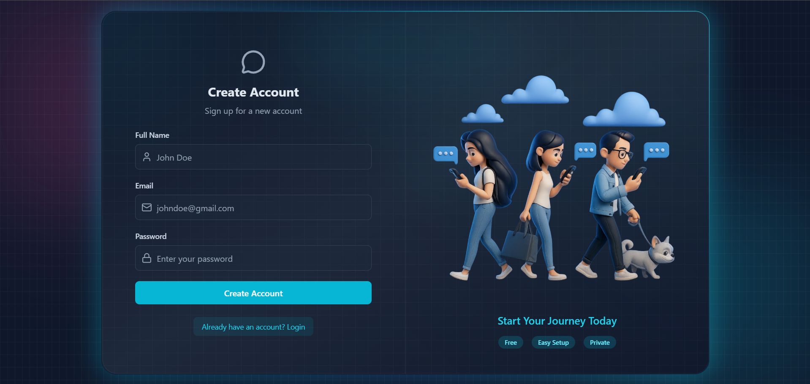
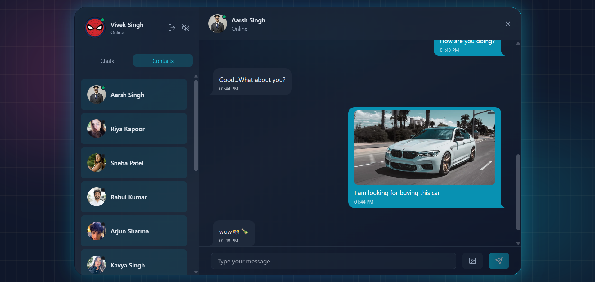

# 🗣️ Talkly — Real-Time Full-Stack Chat Platform


- Built a production-oriented real-time chat platform using the MERN stack  
- Implemented authenticated WebSocket communication using Socket.IO and JWT-based sessions  
- Developed instant live messaging, online presence tracking, media sharing, and real-time UI synchronization   
- Integrated Arcjet-based rate limiting and bot protection for secure API handling  
- Integrated profile image uploads, secure authentication workflows, and production-ready deployment configuration  
- Designed a modern glassmorphism-inspired interface with responsive layouts and animated interactions  
- Focused on scalable real-time communication architecture beyond basic CRUD applications

------------------------------------------------------------------------

## 🌐 Live Demo

https://aarsh-talkly.onrender.com/

------------------------------------------------------------------------

## ✨ Why This Project Stands Out

- Real-time messaging powered by WebSockets and Socket.IO
- Authenticated socket communication using JWT cookies
- Instant online/offline user presence synchronization
- Full-stack ownership across UI, API, database, and live communication systems
- Modern animated UI with glassmorphism-inspired design
- Production-ready architecture and deployment workflow

------------------------------------------------------------------------

## 🧠 Core Features

### 🔐 Authentication & Session Management

-   JWT-based authentication with HTTP-only cookies
-   Protected frontend routes and backend APIs
-   Secure socket authentication workflow
-   Persistent authenticated user sessions

### ⚡ Real-Time WebSocket Communication

-   Instant one-to-one messaging using Socket.IO
-   Authenticated WebSocket connections with JWT validation
-   Real-time online/offline presence tracking
-   Live UI synchronization without refresh
-   Event-driven communication architecture

### 💬 Messaging System

-   Send and receive real-time messages
-   Image sharing inside conversations
-   Persistent chat history stored in MongoDB
-   Dynamic active conversation rendering
-   Real-time notification sounds
-   Keyboard typing sound effects for immersive UX
-   Optimized real-time state management using Zustand 

### 👤 User Profile Management

-   Profile image uploads with Cloudinary
-   Dynamic profile updates
-   Persistent authenticated user state handling

### 🛡️ Security & Reliability

-   Arcjet-based rate limiting and bot protection
-   Protected APIs and socket middleware
-   Secure credential handling
-   Environment-based production configuration

### 🎨 Modern UI/UX

-   Glassmorphism-inspired interface
-   Animated gradient borders
-   Responsive split-screen chat layout
-   Interactive hover effects and transitions

------------------------------------------------------------------------

## 🛠️ Tech Stack

### Frontend

React, Vite, Tailwind CSS, DaisyUI, Zustand, React Router, Axios,
Socket.IO Client, React Hot Toast

### Backend

Node.js, Express, MongoDB, Mongoose, Socket.IO, JWT, Cloudinary,
Arcjet, Resend

------------------------------------------------------------------------

## 📸 Screenshots

### 🔐 Authentication Page
<p align="center">
  
</p>

> Secure login/signup flow with protected authentication and responsive UI.

---

### 💬 Real-Time Messaging & Online Presence
<p align="center">
  
</p>

> Real-time messaging interface powered by Socket.IO with instant UI synchronization and live online/offline presence tracking using authenticated WebSocket connections.

------------------------------------------------------------------------

## 🏗️ Architecture

Client → Socket.IO Client + REST APIs → Express Server →
Socket Middleware + JWT Auth → Controllers → MongoDB / Cloudinary

------------------------------------------------------------------------

## ⚡ Challenges & Learnings

-   Managing authenticated WebSocket connections
-   Synchronizing real-time online user presence
-   Handling socket lifecycle and disconnect events
-   Structuring scalable event-driven communication workflows

------------------------------------------------------------------------

## 🚧 Future Improvements

-   Typing indicators
-   Read receipts
-   Group chats
-   Message reactions
-   Message search and filtering

------------------------------------------------------------------------

## 📦 Project Structure

```text
Talkly/
├── backend/
│   ├── src/
│   │   ├── controllers/
│   │   ├── middleware/
│   │   ├── models/
│   │   ├── routes/
│   │   ├── lib/
│   │   └── server.js
│
├── frontend/
│   ├── src/
│   │   ├── components/
│   │   ├── pages/
│   │   ├── store/
│   │   ├── lib/
│   │   └── App.jsx
│
└── README.md
```

------------------------------------------------------------------------

## 🎯 Recruiter Snapshot

- Built a production-style real-time communication platform using WebSockets
- Demonstrated full-stack ownership across frontend, backend, database, and live socket systems
- Implemented authenticated Socket.IO architecture with JWT validation
- Focused on scalable real-time engineering workflows instead of basic CRUD patterns
- Showcased practical understanding of event-driven communication systems  

------------------------------------------------------------------------
